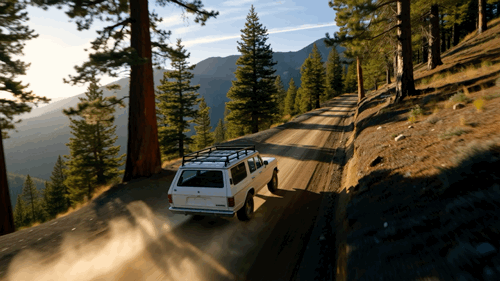
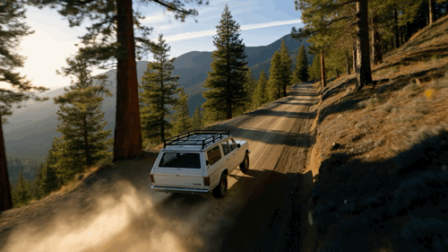
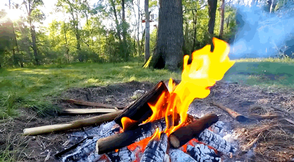
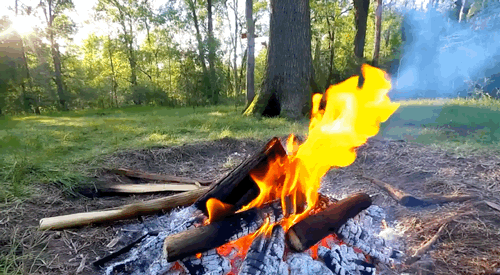

<div align="center">
  <h1>Less is Enough: Training-Free Video Diffusion Acceleration via Runtime-Adaptive Caching</h1>

<a href="https://lmd0311.github.io/" target="_blank" rel="noopener noreferrer">Xin Zhou</a><sup>1\*</sup>,
<a href="https://dk-liang.github.io/" target="_blank" rel="noopener noreferrer">Dingkang Liang</a><sup>1\*</sup>,
Kaijin Chen<sup>1</sup>, Tianrui Feng<sup>1</sup>,
<a href="https://scholar.google.com/citations?user=PVMQa-IAAAAJ&hl=en" target="_blank" rel="noopener noreferrer">Xiwu
Chen</a><sup>2</sup>, Hongkai Lin<sup>1</sup>, <br>
<a href="https://scholar.google.com/citations?user=gdP9StQAAAAJ&hl=en" target="_blank" rel="noopener noreferrer">Yikang
Ding</a><sup>2</sup>, Feiyang Tan<sup>2</sup>,
<a href="https://scholar.google.com/citations?user=4uE10I0AAAAJ&hl=en" target="_blank" rel="noopener noreferrer">
Hengshuang Zhao</a><sup>3</sup>,
<a href="https://scholar.google.com/citations?user=UeltiQ4AAAAJ&hl=en" target="_blank" rel="noopener noreferrer">Xiang
Bai</a><sup>1†</sup>

<sup>1</sup> Huazhong University of Science and Technology, <sup>2</sup> MEGVII Technology, <sup>3</sup> University of
Hong Kong <br>

(\*) Equal contribution. (†) Corresponding author.

[](https://H-EmbodVis.github.io/EasyCache/)
[](https://github.com/LMD0311/EasyCache/blob/main/LICENSE)

</div>

---

This document provides the implementation for accelerating the [**Wan2.2**](https://github.com/Wan-Video/Wan2.2) model
using **EasyCache**.
> This is a nightly preview version that has only been tested on Wan2.2-TI2V-5B.

### ✨ Visual Comparison

<details>
<summary>Prompt: "The camera follows behind a white vintage SUV with a black roof rack ...</summary>
<p>
Prompt: "The camera follows behind a white vintage SUV with a black roof rack as it speeds up a steep dirt road surrounded by pine trees on a steep mountain slope, dust kicks up from it’s tires, the sunlight shines on the SUV as it speeds along the dirt road, casting a warm glow over the scene. The dirt road curves gently into the distance, with no other cars or vehicles in sight. The trees on either side of the road are redwoods, with patches of greenery scattered throughout. The car is seen from the rear following the curve with ease, making it seem as if it is on a rugged drive through the rugged terrain. The dirt road itself is surrounded by steep hills and mountains, with a clear blue sky above with wispy clouds."
</p>
</details>

|         Wan2.2-T2V-A14B (720p, H20)         |        EasyCache (Ours, 720p, H20)         |
|:-------------------------------------------:|:------------------------------------------:|
|  |      |
|         **Inference Time: ~5729s**          | **Inference Time: ~2603s (~2.2x Speedup)** |

<details>
<summary>Prompt: "A cinematic shot of a Star Wars X-wing fighter in flight ...</summary>
<p>
Prompt: "A cinematic shot of a Star Wars X-wing fighter in flight, positioned against the backdrop of a lush, tropical planet featuring clear blue oceans, green islands, and swirling white clouds, as seen from space. A massive, circular space station is visible orbiting the planet in the distance. Several other Rebel starfighters are scattered in the background, creating a sense of a larger fleet presence. The primary X-wing is sharply detailed, highlighting its iconic design and battle-worn texture. The glow from its engines is a vibrant reddish-pink, indicating active propulsion. The camera smoothly moves around the X-wing, offering dynamic views of the spacecraft and the breathtaking vista of the planet and the orbital station. Add subtle atmospheric haze and lens effects for added visual depth and realism."
</p>
</details>

|         Wan2.2-I2V-A14B (720p, H20)         |        EasyCache (Ours, 720p, H20)         |
|:-------------------------------------------:|:------------------------------------------:|
|  |      |
|         **Inference Time: ~5481s**          | **Inference Time: ~2491s (~2.2x Speedup)** |

<details>
<summary>Prompt: "A campfire burns in a sunlit forest clearing ...</summary>
<p>
Prompt: "A campfire burns in a sunlit forest clearing, with bright sparks occasionally leaping out."</p>
</details>

|      Wan2.1-TI2V-5B (T2V task, 720p, H20)      |         EasyCache (Ours, 720p, H20)         |
|:----------------------------------------------:|:-------------------------------------------:|
|  |  |
|           **Inference Time: ~578s**            |  **Inference Time: ~255s (~2.3x Speedup)**  |

<details>
<summary>Prompt: "Summer beach vacation style, a white cat wearing sunglasses sits on a surfboard ...</summary>
<p>
Prompt: "Summer beach vacation style, a white cat wearing sunglasses sits on a surfboard. The fluffy-furred feline gazes directly at the camera with a relaxed expression. Blurred beach scenery forms the background featuring crystal-clear waters, distant green hills, and a blue sky dotted with white clouds. The cat assumes a naturally relaxed posture, as if savoring the sea breeze and warm sunlight. A close-up shot highlights the feline's intricate details and the refreshing atmosphere of the seaside."
</p>
</details>

|      Wan2.2-TI2V-5B (I2V task, 720p, H20)      |         EasyCache (Ours, 720p, H20)         |
|:----------------------------------------------:|:-------------------------------------------:|
|  |  |
|           **Inference Time: ~560s**            |  **Inference Time: ~224s (~2.5x Speedup)**  |

---

### 🚀 Usage Instructions

**a. Prerequisites** ⚙️

Before you begin, please follow the instructions in
the [official Wan2.2 repository](https://github.com/Wan-Video/Wan2.2) to configure the required environment and download
the pretrained model weights.

**b. Copy Files** 📂

Copy `easycache_generate.py` into the root directory of your local `Wan2.2` project.

**c. Run Inference** ▶️

#### **1. EasyCache Acceleration for Wan2.2 T2V-A14B**

```bash
python easycache_generate.py \
  --task t2v-A14B \
  --size "1280*720" \
  --ckpt_dir ./Wan2.2-T2V-A14B \
  --offload_model True \
  --convert_model_dtype \
  --prompt "The camera follows behind a white vintage SUV with a black roof rack as it speeds up a steep dirt road surrounded by pine trees on a steep mountain slope, dust kicks up from it’s tires, the sunlight shines on the SUV as it speeds along the dirt road, casting a warm glow over the scene. The dirt road curves gently into the distance, with no other cars or vehicles in sight. The trees on either side of the road are redwoods, with patches of greenery scattered throughout. The car is seen from the rear following the curve with ease, making it seem as if it is on a rugged drive through the rugged terrain. The dirt road itself is surrounded by steep hills and mountains, with a clear blue sky above with wispy clouds." \
  --base_seed 42
```

#### **2. EasyCache Acceleration for Wan2.2 I2V-A14B**

```bash
python easycache_generate.py \
  --task i2v-A14B --size "1280*720" \
  --ckpt_dir ./Wan2.2-I2V-A14B \
  --offload_model True \
  --convert_model_dtype \
  --image examples/xwing.png \
  --prompt "A cinematic shot of a Star Wars X-wing fighter in flight, positioned against the backdrop of a lush, tropical planet featuring clear blue oceans, green islands, and swirling white clouds, as seen from space. A massive, circular space station is visible orbiting the planet in the distance. Several other Rebel starfighters are scattered in the background, creating a sense of a larger fleet presence. The primary X-wing is sharply detailed, highlighting its iconic design and battle-worn texture. The glow from its engines is a vibrant reddish-pink, indicating active propulsion. The camera smoothly moves around the X-wing, offering dynamic views of the spacecraft and the breathtaking vista of the planet and the orbital station. Add subtle atmospheric haze and lens effects for added visual depth and realism." \
  --base_seed 42
```

#### **3. EasyCache Acceleration for Wan2.2 TI2V-5B (T2V task)**

```bash
python easycache_generate.py \
  --task ti2v-5B \
  --size "1280*704" \
  --ckpt_dir ./Wan2.2-TI2V-5B \
  --prompt "A campfire burns in a sunlit forest clearing, with bright sparks occasionally leaping out." \
  --base_seed 42
```

#### **4. EasyCache Acceleration for Wan2.2 TI2V-5B (I2V task)**

```bash
python easycache_generate.py \
  --task ti2v-5B \
  --size "1280*704" \
  --ckpt_dir ./Wan2.2-TI2V-5B \
  --image examples/i2v_input.JPG \
  --prompt "Summer beach vacation style, a white cat wearing sunglasses sits on a surfboard. The fluffy-furred feline gazes directly at the camera with a relaxed expression. Blurred beach scenery forms the background featuring crystal-clear waters, distant green hills, and a blue sky dotted with white clouds. The cat assumes a naturally relaxed posture, as if savoring the sea breeze and warm sunlight. A close-up shot highlights the feline's intricate details and the refreshing atmosphere of the seaside." \
  --base_seed 42
```

## 🌹 Acknowledgements

We would like to thank the contributors to the [Wan2.2](https://github.com/Wan-Video/Wan2.1) repository, for the open
research and exploration. We also extend our gratitude to [@AChowdhury1211](https://github.com/AChowdhury1211) for the
assistance.

## 📖 Citation

If you find this repository useful in your research, please consider giving a star ⭐ and a citation.

```bibtex
@article{zhou2025easycache,
  title={Less is Enough: Training-Free Video Diffusion Acceleration via Runtime-Adaptive Caching},
  author={Zhou, Xin and Liang, Dingkang and Chen, Kaijin and and Feng, Tianrui and Chen, Xiwu and Lin, Hongkai and Ding, Yikang and Tan, Feiyang and Zhao, Hengshuang and Bai, Xiang},
  journal={arXiv preprint arXiv:2507.02860},
  year={2025}
}
```
